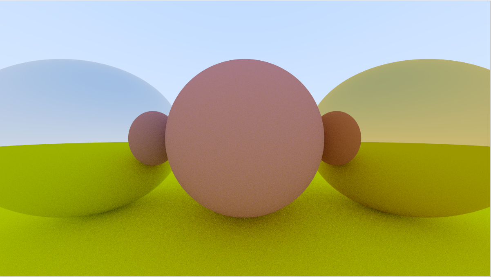

# Rust Tracing - Ray Tracing in a weekend, but in Rust

I wanted to learn Rust and needed a decent project to learn the basics. And since I wanted to implement the [Ray Tracing in one weekend](https://raytracing.github.io/books/RayTracingInOneWeekend.html), I thought this would be a nice way to learn all basics of Rust, e.g. defining modules, working with structs, especially with the borrow-checker, etc. 

## Requirements

To run the Ray Tracer you need [Rust](https://www.rust-lang.org/) and its package manager [Cargo](https://github.com/rust-lang/cargo) installed. For the installation please refer to the [official Rust website](https://www.rust-lang.org/tools/install).

## Running

To run the Ray Tracer just execute the following command in the root directory:

```sh
cargo run --release
```

## Progress so far... 😃

I forgot to document the previous iterations of the Ray Tracer, so let's start now.



## Disclaimer

This implementation is as unoptimized as it could be since it's a way for me to learn Rust in depth. Once it's up and running, maybe I'll try to optimize it and improve the performance. But I'm not sure yet. I'm at the beginning of learning Rust and coming from a Java background with OOP as the main paradigm for implementing things, it's quite difficult for me to translate the article of *Peter Shirley, Trevor David Black, and Steve Hollasch*.


## Ideas for the future

At some point, I'd like to move all the expensive calculations to the GPU and create a Ray Tracer that can be used in a more dynamic way. I'd like to be able to define spheres through a GUI and add them to the scene on the fly. I know this is something that game engines have out of the box. The main reason why I started this minor project is to understand the math behind Ray Tracing, implement it for myself, and do so by using Rust. 😁